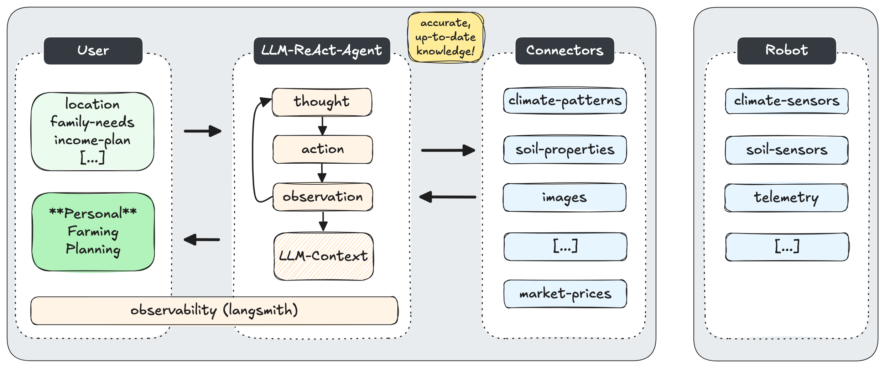

# Sandworm: Restoring and Preserving Natural Ecosystems with AI

SandWorm helps farmers and communities around the world to restore and preserve Agricultural Ecosystems.

- **Preservation**: A farming assisstant generates personal seasonal farming plans based on family needs and environment data (weather data, soil characteristics, and crop market prices).

- **Restoration**: A robot mimics livestock grazing behaviour to mitigate dessertification and expand agriculture land.

## Architecture

The farming assisstant is provided as a conversational interface. At its core, we implement an LLM Agent following a ReAct *thought-action-observation* loop. 

This iterative process allows the model to alternate between generating reasoning (thoughts), executing actions (retrieving climate, soil and market data), and observing the results of those actions. In this framework, each thought informs the next action based on previous observations, enabling the agent to adapt dynamically to its environment.

By integrating this approach, we support an extendable architecture to generate personal farming plans more effectively and interactively.

<p align="center">
  
</p>

## Observability

<p align="center">
  
</p>

## Demo App (Generate Personal Farming Plans)

See https://tedai-sandworm.streamlit.app/ 

<p align="center">
  
</p>

## Demo Grazing Simulation (Restore Dessertification)


## 🚀 Quickstart

1. Clone the repository:
```
git clone git@github.com:dcarpintero/sandworm.git
```

2. Create and Activate a Virtual Environment:

```
Windows:

py -m venv .venv
.venv\scripts\activate

macOS/Linux

python3 -m venv .venv
source .venv/bin/activate
```

3. Install dependencies:

```
pip install -r requirements.txt
```

4. Launch Web Application

```
streamlit run ./app.py
```

## Team Members

- Fatima Lundgren
- Dr. Thomas Hiebaum
- Diego Carpintero

With ❤️ for TED.AI Vienna 2024